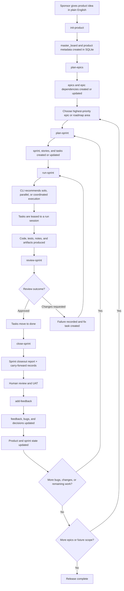
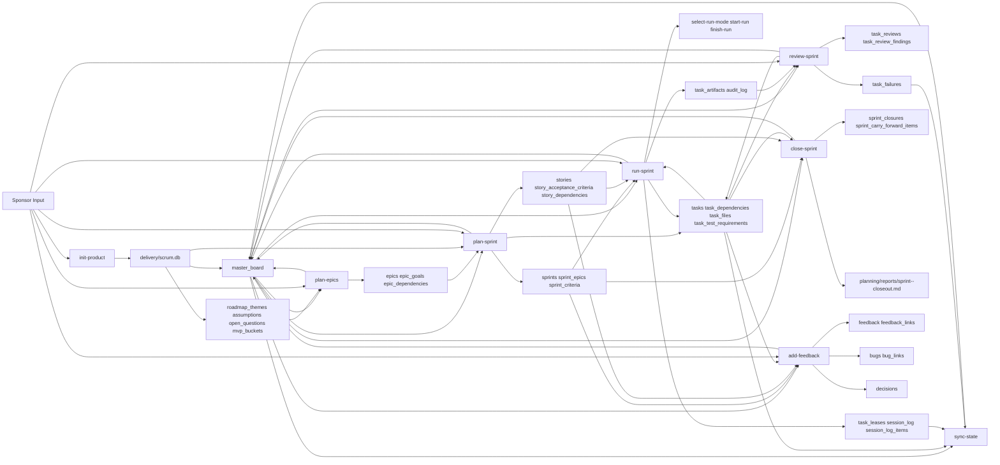

# AI Scrum Workflow Diagram

## Mermaid Diagram



## Skill/Data Dependencies



## Simple Tree View

```text
Sponsor Idea
└── init-product
    └── delivery/scrum.db
        └── plan-epics
            └── epics
                └── plan-sprint
                    └── sprint + stories + tasks
                        └── run-sprint
                            └── task leases + run session
                                └── AI agents build tasks
                                    └── review-sprint
                                        ├── approve -> done
                                        └── request changes -> fix task
                                            └── run-sprint
                                    └── close-sprint
                                        ├── carry-forward
                                        └── closeout report
                                    └── Human review + UAT
                                        └── add-feedback
                                            ├── bugs
                                            ├── feedback
                                            ├── decisions
                                            └── updates back to SQLite
                        └── sync-state
                            └── recovery / repair lane for sessions and leases
```

## One-Line Summary

`Idea -> initialize product in SQLite -> plan epics -> plan one sprint -> run with leases -> review -> close sprint -> feedback -> sync when needed -> repeat`
