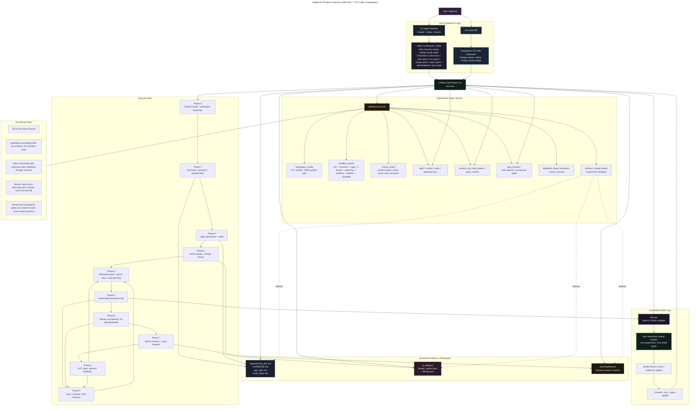

# Unified Harness Architecture

This diagram shows the recommended merged system:

- `scrum-test` provides the durable SQLite control plane
- `myharness` provides the full product lifecycle and VS Code-first experience
- markdown and `.design.json` files remain valuable artifacts, but the database is the source of truth

## Ownership Model

### Authoritative

- SQLite tables for workflow state, planning state, execution state, review state, and feedback state
- `next_command` and lifecycle progression derived from DB state
- runner task selection via DB leases, not file scanning

### Artifact Outputs

- `requirements_doc.md`, `CODEBASE.md`, `app_spec.md`, and `audit_report.md`
- `ui_designs/design_system.json` and `ui_designs/**/*.design.json`
- closeout reports and optional exports in `planning/reports/`

### Explicitly Avoid

- using `harness.state.json` as the main workflow state
- using `feature_list.json` as the main execution backlog
- using `progress.txt` as the main session history

Those can exist temporarily during migration, but the merged system should treat them as compatibility exports at most.

## What Changed In The Merge

### Removed As Primary Workflow State

- `harness.state.json` is no longer the authoritative lifecycle state store.
- `feature_list.json` is no longer the authoritative backlog or execution plan.
- `progress.txt` is no longer the authoritative session ledger.
- the file-first rule from `myharness` is replaced by a DB-first rule.

### Kept But Reframed As Artifacts

- `requirements_doc.md`
- `CODEBASE.md`
- `app_spec.md`
- `audit_report.md`
- `ui_designs/design_system.json`
- `ui_designs/**/*.design.json`
- sprint closeout and exported reports in `planning/reports/`

These still exist and still matter, but they are outputs and references tracked by the database rather than the main workflow state.

### Modified Behavior

- the harness runner leases work from SQLite instead of scanning `feature_list.json`
- planning produces epics, stories, tasks, dependencies, and milestones in the DB instead of a flat feature file
- `/start`, `/resume`, `/status`, `/design`, `/build`, and `/quick` become DB-backed workflow commands
- the VS Code extension reads both design files and DB status instead of only rendering `.design.json`
- milestone and review gates move from file checkpoints to DB-backed sprint and acceptance logic
- session history moves into `session_log`, `task_leases`, `policy_events`, reviews, failures, and closeout records

### Kept Intact

- the end-to-end lifecycle from idea to research to spec to design to build
- CLI-agnostic execution across Claude, Codex, and Gemini
- the VS Code companion concept
- the DB-backed planning, review, fix-task, closeout, and feedback loops from `scrum-test`

## Slash Commands

The merged system should expose one unified skill surface inside VS Code terminal sessions. The commands below are grouped by their main purpose, but all of them should route through `ai-scrum` and the SQLite state model.

### Lifecycle Commands

- `/start`
  Bootstraps a project, reads config, determines greenfield or brownfield flow, and starts discovery or research.
- `/resume`
  Resumes from the current DB-tracked workflow phase and rehydrates the next recommended action.
- `/status`
  Shows current phase, active sprint, review queue, acceptance gates, bugs, feedback, and recommended next command.
- `/design`
  Runs or resumes the UI/UX design phase, updates artifact tracking, and manages design freeze.
- `/build`
  Starts or resumes the automated execution loop after planning and design gates are satisfied.
- `/quick`
  Runs a lighter-weight path for small scoped changes while still logging execution state in the DB.

### Product Setup Commands

- `/init-product`
  Creates the top-level product record and initial product framing from a plain-English idea.
- `/plan-epics`
  Breaks the approved product direction into epics and dependencies.
- `/plan-sprint`
  Creates or extends exactly one sprint with stories, tasks, dependencies, and acceptance criteria.

### Execution Commands

- `/run-sprint`
  Leases ready tasks, chooses execution mode, and drives implementation work through the orchestrator.
- `/review-sprint`
  Reviews submitted work, approves strong work, or creates fix tasks and findings when changes are needed.
- `/close-sprint`
  Closes the active sprint, writes a closeout report, and carries unfinished work forward.

### Feedback And Recovery Commands

- `/add-feedback`
  Converts sponsor notes, UAT findings, bugs, and change requests into structured DB records linked to the right work items.
- `/sync-state`
  Detects drift, repairs safe inconsistencies, resolves stale leases, and restores the next recommended command.

### Expected Command Semantics In The Unified System

- all commands read and write through `ai-scrum`
- all commands update DB state first and only then generate or refresh files
- all commands can be surfaced in VS Code terminal and optionally reflected in the companion extension
- `/status` and `/resume` should rely on DB-derived `next_command`, not ad hoc file inspection

## Sequential User Journey

1. The user opens the project in VS Code and runs `/start` in the integrated terminal.
2. The system loads workspace config, initializes or verifies the SQLite database, and determines whether the work is greenfield or brownfield.
3. For brownfield work, the system performs discovery and produces `CODEBASE.md` as a reference artifact.
4. The research flow gathers product context, domain constraints, and targeted clarifications from the user.
5. The system writes `requirements_doc.md` and records the workflow phase in the database.
6. The spec flow converts requirements into `app_spec.md`.
7. The audit flow compares requirements and spec, creates `audit_report.md` if needed, and loops until the spec is approved.
8. The design flow generates `design_system.json` and `*.design.json` files under `ui_designs/`.
9. The user reviews designs in the VS Code companion extension and iterates until the design is accepted.
10. The system freezes design artifacts, indexes them in the database, and advances the workflow to planning.
11. The user runs `/init-product` if needed to create or refine the top-level product record.
12. The user runs `/plan-epics` to create major epics, priorities, and dependencies.
13. The user runs `/plan-sprint` to create exactly one active sprint with stories, tasks, dependencies, and acceptance criteria.
14. The user checks `/status` to see the current phase, sprint, review queue, and recommended next command.
15. The user runs `/build` or `/run-sprint` to begin execution.
16. The runner leases ready tasks from the database and launches non-interactive coding sessions in small batches.
17. Each coding session implements work, runs tests, captures evidence, updates task state, and commits progress.
18. Submitted work enters review and acceptance gates tracked in the database.
19. The user or agent runs `/review-sprint` to approve work or request changes.
20. If review fails, the system creates fix tasks and routes them back into the sprint backlog.
21. If work is interrupted or state drifts, the user runs `/sync-state` to repair safe inconsistencies and recover the next step.
22. Once sprint work is complete, the user runs `/close-sprint` to generate the closeout report and carry unfinished work forward.
23. After human review, UAT, or sponsor input, the user runs `/add-feedback` to log bugs, changes, and follow-up requests.
24. The new feedback is linked to epics, stories, tasks, or bugs in the database.
25. The user starts the next cycle by running `/plan-sprint` again, with `/resume` and `/status` always available to re-enter the flow cleanly.

## Suggested Build Order

1. Add phase/artifact/config tables to the SQLite schema.
2. Implement DB-backed `/start`, `/resume`, `/status`, `/design`, and `/build`.
3. Port `myharness` prompts and lifecycle logic to call `ai-scrum`.
4. Change the automated runner to lease DB tasks instead of reading `feature_list.json`.
5. Build the VS Code extension against DB + artifact files.
6. Remove dual-write file state once the DB path is stable.
