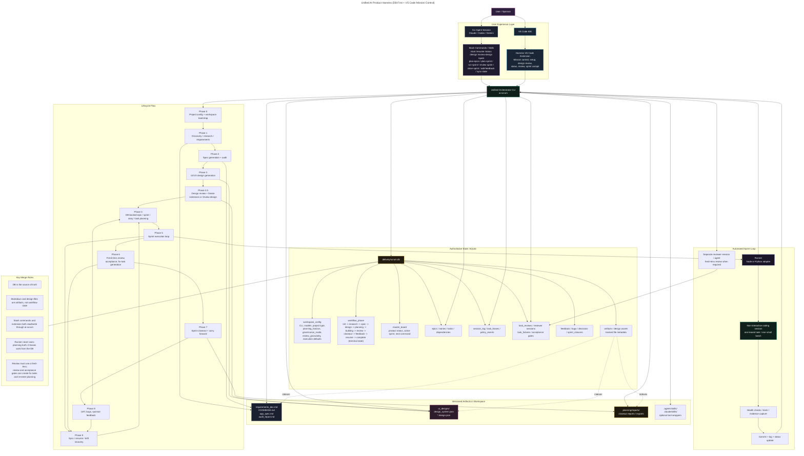

# Unified Harness Architecture

This diagram shows the recommended merged system:

- `scrum-test` provides the durable SQLite control plane
- `myharness` provides the full product lifecycle and VS Code-first experience
- markdown and `.design.json` files remain valuable artifacts, but the database is the source of truth
- the VS Code extension is the primary product shell, while each workspace keeps its own local harness runtime, DB state, config, and skill files

## Ownership Model

### Authoritative

- SQLite tables for workflow state, planning state, execution state, review state, and feedback state
- `next_command` and lifecycle progression derived from DB state
- runner task selection via DB leases, not file scanning

### Artifact Outputs

- `requirements_doc.md`, `CODEBASE.md`, `app_spec.md`, and `audit_report.md`
- `ui_designs/design_system.json` and `ui_designs/**/*.design.json`
- closeout reports and optional exports in `planning/reports/`
- workspace-local skill and command files under `.agents/`, `.claude/`, and other supported tool folders

### Explicitly Avoid

- using `harness.state.json` as the main workflow state
- using `feature_list.json` as the main execution backlog
- using `progress.txt` as the main session history
- relying on the VS Code extension itself as the source of truth instead of the workspace DB and files

Those can exist temporarily during migration, but the merged system should treat them as compatibility exports at most.

## What Changed In The Merge

### Removed As Primary Workflow State

- `harness.state.json` is no longer the authoritative lifecycle state store.
- `feature_list.json` is no longer the authoritative backlog or execution plan.
- `progress.txt` is no longer the authoritative session ledger.
- the file-first rule from `myharness` is replaced by a DB-first rule.

### Kept But Reframed As Artifacts

- `requirements_doc.md`
- `CODEBASE.md`
- `app_spec.md`
- `audit_report.md`
- `ui_designs/design_system.json`
- `ui_designs/**/*.design.json`
- sprint closeout and exported reports in `planning/reports/`

These still exist and still matter, but they are outputs and references tracked by the database rather than the main workflow state.

### Modified Behavior

- the harness runner leases work from SQLite instead of scanning `feature_list.json`
- planning produces epics, stories, tasks, dependencies, and milestones in the DB instead of a flat feature file
- detailed story and task planning should focus on the active sprint; future work should usually remain at epic or backlog level until it is pulled into the next sprint
- `/start`, `/resume`, `/status`, `/design`, `/review-design`, `/run-sprint`, and `/quick` become DB-backed workflow commands
- the VS Code extension becomes the primary product shell and mission-control surface for initialized workspaces
- the VS Code extension reads both design files and DB status instead of only rendering `.design.json`
- workspace-local skill folders are installed into each project so terminal-driven agent tools can read the same project-scoped instructions
- milestone and review gates move from file checkpoints to DB-backed sprint and acceptance logic
- session history moves into `session_log`, `task_leases`, `policy_events`, reviews, failures, and closeout records

### Kept Intact

- the end-to-end lifecycle from idea to research to spec to design to execution
- CLI-agnostic execution across Claude, Codex, and Gemini
- the VS Code extension concept
- the DB-backed planning, review, fix-task, closeout, and feedback loops from `scrum-test`

## Slash Commands

The merged system should expose one unified skill surface inside VS Code terminal sessions. The commands below are grouped by their main purpose, but all of them should route through `ai-scrum` and the SQLite state model.

### Lifecycle Commands

- `/start`
  Bootstraps a project, reads config, determines greenfield or brownfield flow, creates the initial product record, and starts discovery or research. This is the one-time project entry command.
- `/resume`
  Resumes from the current DB-tracked workflow phase and rehydrates the next recommended action.
- `/status`
  Shows current phase, active sprint, review queue, acceptance gates, bugs, feedback, and recommended next command.
- `/design`
  Runs or resumes the UI/UX design phase, updates artifact tracking, and manages design freeze.
- `/review-design`
  Records design approval or requested changes, freezes approved design artifacts, and provides a CLI fallback when the VS Code extension is unavailable. Design review should happen in a separate reviewer context from the design-generation session.
- `/quick`
  Runs a lighter-weight tracked-change path for a small, clearly bounded change inside an existing project while still logging state, evidence, review, and acceptance requirements in the DB.

### Product Setup Commands

- `/plan-epics`
  Breaks the approved product direction into epics and dependencies.
- `/plan-sprint`
  Creates or extends exactly one sprint with stories, tasks, dependencies, and acceptance criteria.

### Execution Commands

- `/run-sprint`
  Starts or resumes the policy-aware sprint execution loop for the active sprint by leasing ready tasks, choosing an execution mode, launching coding work, and deciding whether to continue, notify, or pause.
- `/review-sprint`
  Reviews submitted work from a separate reviewer session, reviewer agent, or human reviewer, then approves strong work or creates fix tasks and findings when changes are needed.
- `/close-sprint`
  Closes the active sprint, writes a closeout report, and carries unfinished work forward.

### Feedback And Recovery Commands

- `/add-feedback`
  Converts sponsor notes, UAT findings, bugs, and change requests into structured DB records linked to the right work items.
- `/sync-state`
  Detects drift, repairs safe inconsistencies, resolves stale leases, and restores the next recommended command.

### Expected Command Semantics In The Unified System

- all commands read and write through `ai-scrum`
- all authoritative workflow state should live in the DB, and generated files should be created or refreshed through DB-backed commands with their resulting artifact state recorded back into the DB
- all commands can be surfaced in VS Code terminals and in the extension UI
- `/status` and `/resume` should rely on DB-derived `next_command`, not ad hoc file inspection
- `/start` should be the one-time bootstrap command that also performs the initial product setup
- `/design` should create or update design artifacts and move them into a reviewable state
- `/review-design` should be the approval command for design decisions whether review happens in the extension or directly in the CLI
- `/run-sprint` should be the primary policy-aware automation command for sprint execution during UAT
- if a future `/build` command is introduced, it should be an alias or thin wrapper rather than a separate orchestration model

## Extension Product Shell

The harness should be packaged as a VS Code extension that is installed once globally, while each project workspace keeps its own local harness runtime. The extension should detect whether the current workspace is already harness-enabled and then either guide setup or open the mission-control dashboard.

### Core Product Shape

- install the VS Code extension once
- open any project workspace
- if the workspace is not initialized, show a guided empty state with an initialize action
- if the workspace is initialized, show the full mission-control dashboard

### Workspace Detection

The extension should detect a harness-enabled workspace using project-local markers such as:

- `delivery/scrum.db`
- harness config files
- workspace-local skill folders
- version markers or install metadata when needed

### One-Click Initialization

When the project is not initialized, the extension should offer a one-click action such as `Initialize Harness In This Project`. That action should prepare the workspace-local runtime, for example by:

- creating required folders
- initializing the database
- writing harness config
- installing workspace-local skill files
- validating the environment
- surfacing the next recommended action

### Mission Control

Once initialized, the extension should act as mission control for the project rather than just a design renderer. It should eventually unify:

- project status dashboard
- active sprint cockpit
- review queue
- blockers and failures
- feedback and bug queue
- design review and design history
- session and execution activity
- closeout readiness
- delivery analytics

### Button-Driven And Terminal-Driven UX

- the extension should provide buttons and commands for the common workflow actions
- users should still be able to run the same actions manually in the terminal
- the extension should call the same DB-backed CLI and orchestration layer rather than inventing a separate workflow
- the extension should be able to open and manage VS Code terminals for setup, execution, repair, and other user-visible long-running operations

### Terminal Integration

- the extension should support opening VS Code terminals when the user benefits from watching the harness work in real time
- terminal-driven execution is especially useful for:
  - workspace initialization
  - `/run-sprint`
  - recovery and repair flows such as `/sync-state`
  - advanced manual workflows where the user wants to inspect live command output
- the extension should still perform dashboard reads, status refreshes, and design review state updates without requiring a visible terminal for every action
- terminal support should complement the mission-control dashboard, not replace it

### Recommended UX Rule

- use silent background reads for status, analytics, queues, and other non-interactive views
- use visible terminals for long-running, user-observable, or potentially interactive operations
- users who enjoy watching autonomous coding sessions should be able to trigger `/run-sprint` through the extension and watch the session in a real VS Code terminal

### Suggested First-Class Actions

- `Initialize Harness`
- `Start`
- `Plan Epics`
- `Plan Sprint`
- `Run Sprint`
- `Review Design`
- `Review Sprint`
- `Close Sprint`
- `Sync State`

### Single-System Rule

- the extension should be a UI over the same system, not a second workflow engine
- the extension should read and write the same DB-backed state as the CLI
- the extension should never become a second source of truth

## Workspace Tooling Strategy

The harness should rely on workspace-local skill folders rather than assuming a universal editor API for slash-command installation across all agent tools.

### Project-Scoped Tool Folders

The extension should install or refresh project-scoped tool folders such as:

- `.agents/skills/`
- `.claude/skills/`
- optional tool-specific folders such as `.codex/` when there is a real need for a separate format

### Why This Approach

- project-local skill files are explicit and portable
- the workspace remains self-contained
- teammates and automation can use the same setup
- the extension can install, update, repair, and version these folders cleanly
- the system does not depend on hidden global editor state for project behavior

### Preferred Structure

- keep one canonical shared source for prompts and skill content
- generate or sync workspace-local wrappers for each supported tool
- use the extension to manage install, update, and repair flows for those folders

### UX Implication

- extension buttons should call the underlying harness CLI directly
- workspace-local skill files should support terminal and agent workflows
- slash-command convenience should be treated as a project-scoped capability, not as the only way to use the harness

## Design Review And Approval

The VS Code extension should be the best design review experience, but it must not be the only one. Design approval should be a DB-tracked workflow step that works through the extension, the CLI, or direct artifact inspection.

### Fresh-Lens Review Rule

- design review should not be performed by the same implementation session that generated the design artifacts
- when the reviewer is an AI agent, the review should happen in a separate review session or separate review agent context
- when the reviewer is a human, the system should still record reviewer identity, decision, findings, and timestamps in the same DB-backed review flow
- the purpose of the review step is to provide a fresh lens, not to let the builder self-certify completion

### Review Tiers

- extension review
  The preferred experience. The user reviews designs through the companion extension using the canvas, screen views, and status surfaces.
- CLI review
  The required fallback. The user reviews design artifact summaries and file references in the terminal, then records a decision through `/review-design`.
- direct artifact review
  The last-resort fallback. The user inspects generated design files directly and still records approval or changes through the same DB-backed command.

### Command Roles

- `/design`
  Generates or updates design artifacts and moves the design into a reviewable state.
- `/review-design`
  Records one of the review outcomes:
  - approve
  - changes_requested
  - skip_design when the change truly does not require design review

### Design States

- `draft`
  Design work is still being generated or revised.
- `pending_review`
  Design artifacts are ready for human review.
- `changes_requested`
  The user requested iteration before implementation can proceed.
- `approved`
  The user explicitly approved the design direction.
- `frozen`
  The approved design snapshot is locked as the implementation reference.
- `superseded`
  A newer frozen design revision has replaced this previously frozen baseline.

### Approval Flow

1. `/design` generates or updates `design_system.json` and `*.design.json` artifacts.
2. The system records those artifacts in the DB and sets the design state to `pending_review`.
3. A separate reviewer context reviews in the extension when available, or through CLI summaries and file references when it is not.
4. The user records a decision through `/review-design`.
5. If the decision is `changes_requested`, design work returns to `draft` or `changes_requested` and another iteration begins.
6. If the decision is `approve`, the system records approval metadata, marks the design as `approved`, and then freezes that approved revision as the implementation baseline.
7. Once the design is `frozen`, planning and sprint execution may proceed.

### Design Freeze Semantics

- `approved` means the human accepted the design direction
- `frozen` means the system has locked that approved design revision as the implementation baseline
- a frozen design is the reference that user-facing implementation work should be evaluated against
- freezing should be a real state transition with stored metadata, not just an informal comment

### What Freeze Captures

When a design is frozen, the system should record enough metadata to answer which exact design was approved for implementation, including:

- design revision identifier
- artifact paths
- content hash or equivalent version marker
- approved by
- approved at
- freeze note or approval note
- linked stories, tasks, and sprint when relevant

### Gating Rules

- design-dependent implementation should not proceed unless:
  - no design review is required
  - or the applicable design revision is `frozen`
  - or a lightweight quick-path exception is explicitly allowed by policy
- user-facing implementation work should normally be reviewed against the frozen design baseline
- planning may prepare implementation work before freeze, but execution of design-sensitive work should wait for freeze
- user-facing UI work should normally require explicit design approval before `/run-sprint` continues
- quick UI changes may use lightweight review, but meaningful visual changes should still require `/review-design`

### Revision And Supersession

- frozen design artifacts should not be silently edited in place
- if design changes are needed after freeze, the system should create a new design revision
- the new revision should move through `draft`, `pending_review`, and approval again
- once a newer design revision is frozen, the older frozen revision should transition to `superseded`
- the historical frozen revision should remain visible for audit and comparison

### Post-Freeze Feedback Behavior

- sponsor or UAT feedback after freeze should create a new design iteration rather than mutating the old baseline without record
- if the feedback is minor and suitable for the quick path, the system may freeze a lightweight replacement revision
- if the feedback materially changes visual direction, hierarchy, or layout, the system should route it through the normal design review cycle

### What Freeze Does Not Mean

- it does not mean the files become permanently immutable
- it does not mean the product can never change after approval
- it means changes after this point must be deliberate, reviewable, and traceable through a new revision or explicit exception

### CLI Fallback Behavior

- `/design` should print the design artifact paths, the current design state, and whether human review is required
- `/status` should surface pending design review alongside the recommended next command
- `/review-design` should allow the user to record:
  - decision
  - reviewer
  - optional notes
  - optional findings or requested changes

### Relationship To The Extension

- the extension should read and write the same DB-backed design review state used by the CLI
- extension approval should not create a separate workflow
- the extension is the premium review surface, not the authoritative state holder

## Fresh-Lens Delivery Review

Major implementation review should be distinct from implementation itself. Renn Code should separate builder, reviewer, and acceptor responsibilities so the system gets a real audit pass instead of self-approval.

### Core Roles

- builder
  The coding agent or coding session that plans or implements the work.
- reviewer
  A separate review agent or separate review session that checks the work against scope, tests, evidence, and exit criteria.
- acceptor
  A human or explicit acceptance gate that decides whether the reviewed work is acceptable for user-facing or policy-sensitive outcomes.

### Core Rule

- `/review-sprint` should run in a separate reviewer context, not reuse the same implementation session that built the work
- the reviewer may be another agent session or a human reviewer, but it should have a fresh lens over the evidence and diff
- implementation may report "ready for review", but it should not self-certify approval for major work
- review and acceptance should remain distinct whenever human acceptance is required

### Review Inputs

The review context should inspect at least:

- scoped goal, story, task, or phase objective
- changed files and relevant diffs
- evidence such as commits, test output, screenshots, or notes
- declared exit criteria and acceptance gates
- prior failures, findings, or follow-up work when relevant

### Review Outcomes

- `approved`
  The work meets technical review expectations and may proceed toward acceptance or closure.
- `changes_requested`
  The work is close but needs follow-up fixes, and the system should create or route fix work.
- `blocked`
  The reviewer cannot responsibly approve because of missing context, failed evidence, policy concerns, or unresolved risk.

### DB Expectations

- review records should capture reviewer identity or reviewer session
- review records should capture decision, summary, findings, and evidence reviewed
- the system should preserve the separation between builder session history and reviewer session history
- story or sprint closure should depend on approved review state, not only on implementation completion state

## Quick Path

`/quick` should be the fast lane for small, bounded work in an already-started project. It should not bypass the system. It should use the same DB-backed workflow, but with less ceremony and a tighter scope.

### Intended Use

- small bug fixes
- small brownfield enhancements
- copy or content changes
- tiny UX or visual adjustments
- small follow-up fixes after review, UAT, or sponsor feedback
- low-risk refactors that do not need full sprint planning

### Not Intended Use

- first-time project bootstrap
- greenfield product creation
- broad feature work spanning multiple stories
- large UX changes that need design exploration
- work with unclear scope, unclear acceptance, or meaningful architecture impact

### Core Semantics

- `/quick` should require an existing project that has already been started through `/start`
- `/quick` should create minimal tracked work in the database rather than bypassing planning entirely
- `/quick` should preserve the same guardrails as the normal workflow: evidence, review, acceptance, and resumability
- `/quick` should be allowed to stop and recommend the normal planning flow when the requested change turns out not to be small

### DB Shape

- `/quick` should create one lightweight story or quick-change container when needed
- `/quick` should create only a very small number of tasks, typically one to three
- `/quick` work should link to related bugs, feedback items, files, or review findings when relevant
- `/quick` should prefer attaching the work to the active sprint when the change belongs there
- if there is no suitable active sprint, the system may use a lightweight quick lane or quick sprint instead of forcing a full planning ceremony

### What `/quick` Skips

- full research and clarification loops unless the change proves ambiguous
- full spec generation and audit unless the change expands beyond a small bounded fix
- full epic-planning and sprint-planning ceremony for routine small work

### What `/quick` Must Still Keep

- DB-backed traceability
- state transitions and auditability
- evidence capture
- review gates
- human acceptance for user-facing or risky work when required

### UI And Design Behavior

- tiny visual or copy changes may stay inside `/quick`
- user-facing UI changes should still be marked for human acceptance where appropriate
- if a requested visual change needs real design exploration, `/quick` should escalate to `/design` and then back into normal planning

### Governance Defaults

- `/quick` should default toward `notify`
- low-risk internal changes may run with `auto`
- sponsor-visible, user-facing, pricing, permissions, or UX-sensitive changes should lean toward `hitl` or explicit human acceptance

### Real-World Scrum Analogy

- `/quick` is the equivalent of a lightweight Jira or Linear ticket for a small change
- it should be tracked, owned, reviewed, and linked to its evidence
- it should not require the full ceremony used for larger planned feature work
- if it grows beyond a small change, it should be escalated into the normal plan-epics and plan-sprint flow

## Automation Model And Modes

The unified system should preserve the old harness idea of an automated coding loop, but adapt it to the DB-first sprint model.

### Planning Scope

- product direction, roadmap, epics, and backlog can be shaped ahead of time in the database
- detailed stories, tasks, acceptance criteria, and dependencies should usually be created for only one active sprint at a time
- future sprints may exist as light placeholders, but they should not usually be decomposed into full task trees until they are the next sprint to execute
- the runner should automate the current active sprint, not the entire product backlog at once

### Governance Modes

- `auto`
  The runner continues through the active sprint without pausing for human approval except on hard blockers, failed gates, or completion.
- `notify`
  The runner continues automatically, but emits milestone summaries or review prompts at defined checkpoints so a human stays informed.
- `hitl`
  The runner pauses at defined checkpoints and waits for explicit human approval before continuing.

These modes control how much human supervision the runner requires. They are workflow-governance choices, not task-selection choices.

### Execution Modes

- `solo`
  Lease and execute one ready task at a time.
- `parallel`
  Lease a small batch of truly independent `parallel_safe` tasks and fan them out only when the host environment supports real concurrent workers.
- `coordinated`
  Lease a small batch that still needs tighter sequencing, shared context, or staged review.
- `auto`
  Let the orchestrator inspect ready tasks and choose `solo`, `parallel`, or `coordinated`.

These modes control how work is leased and executed inside the active sprint. They are separate from the governance modes above.

### Runner Responsibilities

- read the active sprint and DB-derived next command from SQLite
- lease work through `ai-scrum` instead of scanning workspace files
- launch non-interactive coding sessions for leased work
- record evidence, reviews, failures, and completion state back into SQLite
- pause or continue according to governance mode
- stop when the sprint is complete, a review gate fails, a blocker needs human input, or the next command changes to planning, feedback, or closeout

### Implementation Note

- the runner may be implemented in Node or Python, but it should be a thin adapter around `ai-scrum`
- orchestration logic should live in the DB-backed CLI and policy layer, not in file-based state machines
- `run.py`-style automation is acceptable as a compatibility bridge, but the target architecture is still DB-first and sprint-scoped

## Session Model

The unified harness should not use the word "session" to mean only one thing. The system becomes much easier to resume, inspect, and debug if it distinguishes the policy loop from the leased work batches and from the actual coding subprocesses.

### Session Levels

- `runner_session`
  One top-level `/run-sprint` invocation. This is the policy-aware automation loop that applies governance mode, decides whether to continue, and may span multiple leased batches during one sprint run.
- `execution_session`
  One leased batch of sprint work. This is created when the orchestrator selects one or more ready tasks and assigns them under a chosen execution mode such as `solo`, `parallel`, or `coordinated`.
- `coding_session`
  One actual non-interactive coding subprocess or agent run. This is the concrete work unit that edits files, runs checks, captures evidence, and produces a commit or failure outcome.

### Hierarchy

- one `runner_session` may contain one or more `execution_sessions`
- one `execution_session` may contain one or more `coding_sessions`
- a `coding_session` should usually map to one task or one very small bounded task batch

### Operational Meaning

- `runner_session`
  Represents "the automation loop is running"
- `execution_session`
  Represents "this leased batch of sprint work is being executed"
- `coding_session`
  Represents "this specific agent or subprocess performed the coding work"

### Why This Matters

- resume behavior becomes clearer because the system can distinguish a paused top-level run from an unfinished leased batch
- auditability improves because the DB can show not just that a sprint was being run, but exactly which execution batches and coding attempts occurred
- parallel and coordinated modes become easier to reason about because multiple coding sessions can belong to one execution session without collapsing into one ambiguous log row
- failures and retries become easier to model because the harness can retry a coding session without losing the parent execution or runner context

### DB Direction

- current `session_log` may initially store `runner_session` records
- execution-level and coding-level detail may begin as linked child records later, even if the first implementation keeps the schema simple
- the long-term target should preserve enough structure to answer:
  - which top-level `/run-sprint` loop was active
  - which task batch was leased under that run
  - which concrete coding subprocess handled each task

### `/quick` Behavior

- a `/quick` invocation may still create a `runner_session`
- in many cases it will create only one `execution_session`
- in many cases that execution will produce only one `coding_session`
- this keeps `/quick` lightweight without requiring a separate session architecture

## Autonomy Policy

The unified system should not force one universal operating style. Some users will want a "just keep going" autonomous loop, while others will want to review every meaningful feature. The harness should support both by separating planning scope, runner governance, and review checkpoints.

### Core Principle

- autonomy should be a policy choice, not a different architecture
- the system should keep the same DB-first sprint loop in all cases
- what changes is how far ahead the harness plans, when it pauses, and what kind of human approval it requires

### Policy Knobs

- `planning_horizon`
  Controls how far ahead the harness creates detailed work.
  Recommended values:
  - `active_sprint`
  - `next_sprint`
  - `auto_chain`
- `governance_mode`
  Controls whether the runner keeps going or pauses at checkpoints.
  Recommended values:
  - `auto`
  - `notify`
  - `hitl`
- `review_granularity`
  Controls how often human review is required.
  Recommended values:
  - `task`
  - `story`
  - `sprint`
  - `risk_based`

### Recommended Meaning

- `planning_horizon = active_sprint`
  Fully decompose only the current active sprint. Keep future work at epic or backlog level.
- `planning_horizon = next_sprint`
  Keep the current sprint detailed and allow a light draft of the next sprint for faster handoff.
- `planning_horizon = auto_chain`
  Allow the harness to finish one sprint, perform closeout, plan the next sprint, and continue automatically within configured limits when governance policy allows those transitions without a mandatory human checkpoint.

- `governance_mode = auto`
  Continue automatically unless blocked by failed gates, unresolved blockers, or final completion.
- `governance_mode = notify`
  Continue automatically, but emit milestone summaries or review notifications at defined checkpoints.
- `governance_mode = hitl`
  Pause for explicit human approval at defined checkpoints before continuing.

- `review_granularity = task`
  Suitable for highly sensitive or high-risk work where every task needs visible review.
- `review_granularity = story`
  A good default for user-facing features, where a small set of tasks rolls up into one reviewable outcome.
- `review_granularity = sprint`
  Useful for trusted low-risk work where the human only wants a sprint-level checkpoint.
- `review_granularity = risk_based`
  Prefer automation for low-risk technical work and require human review for risky, user-facing, or policy-sensitive work.

### Recommended Product Behavior

- do not fully decompose the entire project into all stories and tasks up front
- keep product direction, epics, backlog themes, and future candidates in the database
- let the runner automate one sprint deeply
- if the user wants "the whole project done autonomously", interpret that as chained sprint execution, not one giant fully-expanded backlog plan
- use story-level or sprint-level acceptance gates to keep autonomy from bypassing human judgment

### Suggested Operating Presets

- `full_autopilot`
  - `planning_horizon = auto_chain`
  - `governance_mode = auto`
  - `review_granularity = risk_based`
  - intended for trusted environments where the harness should keep shipping until it hits blockers, failed gates, or configured limits

- `balanced`
  - `planning_horizon = active_sprint`
  - `governance_mode = notify`
  - `review_granularity = story`
  - intended for teams that want steady automation with visible checkpoints and human awareness

- `feature_review_heavy`
  - `planning_horizon = active_sprint`
  - `governance_mode = hitl`
  - `review_granularity = story` or `task`
  - intended for UI-heavy, sponsor-visible, or quality-sensitive work where each feature should be reviewed before the runner continues

### Risk-Aware Defaults

- backend, refactors, infra, and low-risk maintenance work can usually default toward `auto`
- user-facing UI, copy, UX flows, pricing, permissions, compliance, and sponsor-visible behavior should usually default toward `notify` or `hitl`
- stories marked with human acceptance requirements should override global autonomy and force a human checkpoint before closure

### Guardrails For Chained Automation

- auto-chaining should move sprint by sprint, not project-wide task explosion
- the runner should stop after a configurable maximum number of chained sprints if requested
- the runner may automatically traverse closeout and next-sprint planning steps only when `planning_horizon = auto_chain` and governance policy allows those transitions without human approval
- otherwise, the runner should stop whenever `next_command` changes away from sprint execution into closeout, feedback, or planning that needs human input
- the runner should stop when review gates fail, blockers are unresolved, or acceptance requirements are unmet
- the runner should always preserve a clean resume path through DB state and session logs
- when review is required, the runner should hand work to a separate reviewer context instead of letting the active builder session approve its own output

### Auto-Chain Limits And Config

`auto_chain` should be bounded autonomy, not an unlimited background loop. The runner should be able to continue across multiple sprints only while explicit limits remain within policy and the project stays in a healthy state.

Recommended config fields include:

- `max_auto_sprints`
  The maximum number of sprints the runner may chain without human intervention.
- `max_auto_tasks_per_run`
  A cap on how many tasks may be executed inside one autonomous run.
- `max_auto_failures`
  The maximum number of failure events allowed before the runner must stop and ask for help.
- `max_auto_review_cycles`
  The maximum number of automated review-and-fix loops allowed before pausing.
- `auto_chain_requires_healthy_state`
  Whether the runner may continue only when the project has no unresolved blockers, failed gates, pending acceptance, or stale conflicts.
- `allow_auto_close_sprint`
  Whether sprint closeout may happen automatically once exit conditions are satisfied.
- `allow_auto_plan_next_sprint`
  Whether the runner may plan the next sprint automatically after closeout.
- `allow_auto_feedback_ingest`
  Whether the system may automatically ingest and route feedback without a human checkpoint. This should usually default conservatively.
- `auto_chain_stop_on_user_facing_work`
  Whether the runner should force a pause before continuing into a sprint that contains high-risk or sponsor-visible work.

### Recommended Defaults

- default toward conservative bounds rather than unbounded autonomy
- `max_auto_sprints` should start small
- `max_auto_failures` should start small
- `max_auto_review_cycles` should start small
- `auto_chain_requires_healthy_state` should usually be enabled
- `allow_auto_close_sprint` may be enabled only when exit criteria and acceptance gates are strong enough
- `allow_auto_plan_next_sprint` should default more conservatively than sprint closeout
- `allow_auto_feedback_ingest` should usually default off until feedback routing is well proven

### End-Of-Sprint Continuation Rules

At the end of a sprint, the runner should continue into the next sprint only if all of the following are true:

1. `planning_horizon = auto_chain`
2. the configured sprint limit has not been reached
3. the configured task, failure, and review-loop limits have not been reached
4. the project is in a healthy state
5. auto-close is allowed when closeout is required
6. auto-plan is allowed when next-sprint planning is required
7. no human-required gates remain unresolved for the current or next sprint

If any of those conditions fail, the runner should stop cleanly, set the next recommended command, and explain why it paused.

### Healthy State Definition

For auto-chain purposes, a healthy state should usually mean:

- no unresolved blockers
- no failed review gates waiting on human judgment
- no unmet human acceptance requirements
- no pending design reviews required for upcoming design-sensitive work
- no unresolved conflict events that make the next execution step unsafe
- no ambiguity about what the next sprint should be

### Always-Stop Conditions

The runner should stop even in `auto_chain` mode when it encounters:

- pending human design review
- pending human acceptance requirements
- repeated failures beyond configured limits
- unresolved blockers
- policy violations that require human judgment
- an ambiguous or unhealthy planning state
- an explicit user or config stop condition

## Concurrency And Conflict Model

Parallel execution should be conservative by default. The goal is to behave like a disciplined engineering team, not to maximize concurrency at the cost of merge chaos, file conflicts, or hard-to-reason-about state.

### Core Rule

- a task may run in parallel only when it is both dependency-safe and write-safe
- `parallel_safe` by itself is not enough
- if write scope is overlapping or unknown, the orchestrator should downgrade execution to `coordinated` or `solo`

### Operational Safety Layers

- lease safety
  A task lease prevents the same task from being actively claimed by more than one worker at a time.
- write-scope safety
  The runner should compare the intended write targets of candidate tasks before launching them together.
- conflict policy
  When overlap is detected, the runner should refuse unsafe parallel execution and choose a safer mode.

### Task Metadata Expectations

- tasks intended for automation should declare likely file targets or a `write_scope`
- tasks may also declare shared resources, generated outputs, or coordination groups when useful
- tasks with unclear write scope should be treated conservatively
- unknown scope should mean "not parallel" unless a human explicitly overrides it

### Conflict Categories

- hard conflict
  Two tasks target the same file, the same generated artifact, the same migration, the same lockfile, the same environment/config file, or another clearly exclusive resource.
- soft conflict
  Two tasks touch the same subsystem, shared tests, shared types, or another area that may still be parallelizable only with tighter coordination.
- no known conflict
  The tasks are dependency-safe and target clearly separate files or work areas.

### Scheduling Rules

- dependency-safe plus no known conflict should allow `parallel`
- dependency-safe plus soft conflict should prefer `coordinated`
- hard conflict should force `solo` or serialized execution
- unclear or missing scope should default away from `parallel`

### Runtime Behavior

Before launching parallel work, the runner should:

1. select ready tasks
2. verify dependency safety
3. compare write scopes and shared resources
4. split tasks into:
   - a parallel-safe batch
   - a coordinated batch
   - solo leftovers

If a conflict is detected after launch:

- the conflicting task should be paused, re-queued, or downgraded
- the system should record a conflict event in the database
- future scheduling should prefer the safer mode for the same overlap pattern

### Commit And Merge Discipline

- each coding session should prefer producing one isolated unit of progress, usually one task or one very small bounded batch
- the system should prefer small commits with clear evidence over large blended parallel changes
- parallel workers should not assume they can safely modify the same branch state without coordination
- if isolation is not guaranteed, the orchestrator should integrate work sequentially or downgrade the mode

### Real-World Analogy

- this is how disciplined Scrum and Jira teams already behave in practice
- separate tickets with separate files can move in parallel
- shared modules, shared contracts, or shared configuration usually require coordination
- when boundaries are unclear, experienced teams usually serialize the work rather than gambling on concurrency

## Retries And Failure Handling

Failures should be first-class execution outcomes, not hidden implementation details. The harness should prefer traceability, bounded recovery, and explicit escalation over silent retries or destructive cleanup.

### Core Principle

- failure should be recorded as real workflow state
- retries should be explicit, bounded, and reserved for recoverable failures
- partial work should be preserved by default rather than silently discarded
- repeated or non-recoverable failures should create backpressure through blocking, follow-up work, or human review

### Failure Outcomes

Each coding session should end in a concrete outcome such as:

- `completed`
- `failed`
- `blocked`
- `abandoned`
- `timed_out`

These outcomes should be visible in the DB and should roll up cleanly into execution-session and runner-session state.

### Failure Categories

The harness should distinguish at least these kinds of failure:

- `test_failure`
- `merge_conflict`
- `write_conflict`
- `policy_violation`
- `missing_context`
- `tool_error`
- `environment_error`
- `review_rejected`
- `acceptance_rejected`

Different categories should drive different recovery behavior. A flaky tool error is not the same as a failed human review.

### Retry Policy

- automatic retries should be allowed only for recoverable failures
- automatic retries should be bounded by a small configured limit
- policy failures, review failures, acceptance failures, and repeated implementation failures should not be retried blindly
- after the retry limit is reached, the system should downgrade mode, block the task, create follow-up work, or require human input

### Recoverable Versus Non-Recoverable Failures

- likely recoverable
  - transient tool errors
  - environment hiccups
  - timeouts
  - recoverable merge or update problems
- likely non-recoverable without intervention
  - missing requirements or missing design approval
  - policy violations
  - repeated test failures with the same root cause
  - review rejection
  - human acceptance rejection

### Partial Work Policy

- failed attempts should not be auto-reverted by default
- the system should preserve available evidence from failed work, including:
  - partial file changes
  - commit references
  - test output
  - generated artifacts
- failed partial work may still be useful context for the next attempt, for review, or for a follow-up repair task
- destructive cleanup should be explicit and policy-driven, not automatic by default

### Failure Escalation Flow

1. a coding session runs and records its outcome
2. if the outcome is successful, the work moves toward review
3. if the failure is recoverable and still under the retry limit, the runner may retry
4. if the failure is repeated or non-recoverable, the system should:
   - record a durable failure entry
   - update the task or execution state appropriately
   - recommend the next action
   - create follow-up or fix work when useful

### Fix And Follow-Up Work

- do not create a new fix task for every transient hiccup
- create fix or follow-up work when:
  - the retry limit has been reached
  - review found concrete required changes
  - the failure produced a clearly separable repair step
  - keeping the repair as explicit tracked work is cleaner than mutating the original task indefinitely

### Session Interaction

- the `runner_session` decides whether a retry is allowed
- the `execution_session` captures the outcome of the leased batch
- the `coding_session` records the concrete failed or successful attempt
- durable failure records should survive across sessions so that the next run can resume with context instead of guessing

### DB Direction

The long-term model should be able to answer:

- how many attempts a task has had
- what the most recent failure kind and summary were
- whether the failure was recoverable
- whether the attempt produced a commit, artifacts, or partial code changes
- whether cleanup, follow-up, or human review is now required

### Real-World Analogy

- disciplined teams keep failed attempts visible
- they distinguish transient execution problems from real implementation or review failures
- they do not retry rejected work forever
- they often convert repeated or review-discovered failure into explicit fix tickets
- they preserve evidence so the next person or next run can recover intelligently

## Git Strategy

The harness should use Git as the code-history system, not as the primary planning or orchestration system. The database should remain the source of truth for workflow state, while Git records the implementation history produced by coding sessions.

### Recommended Branch Model

- `main`
  The canonical integration branch and the expected stable line of development.
- short-lived task branches
  The preferred branch model for autonomous work. A coding session should usually work on a short-lived branch tied to one task or one very small bounded task batch.
- optional quick-change branches
  Small `/quick` changes may use very short-lived branches or another lightweight isolated path, but they should still avoid long-lived divergence.

### Why This Fits The Harness

- the DB already tracks planning state, review state, feedback, and execution history
- Git should not become a second planning system
- short-lived branches reduce merge pain and make autonomous execution safer
- isolated branches map cleanly to coding sessions, especially in `parallel` mode

### Branch Naming

Branch names should be boring, machine-friendly, and traceable back to the DB work items when possible. Examples:

- `codex/task-TASK-123`
- `codex/quick-20260315-cta-copy`
- `codex/review-fix-TASK-123`

### Session Interaction

- in `solo` mode, a coding session may work directly in one isolated short-lived branch for one task or one small bounded task batch
- in `parallel` mode, each coding session should use its own branch; multiple parallel workers should not share one dirty branch state
- in `coordinated` mode, work may still use separate branches, but the orchestrator should merge or integrate them in a planned sequence

### Commit Strategy

- each coding session should prefer producing one meaningful commit when possible
- commit messages should be small, task-oriented, and traceable to the relevant task or review item
- commits should favor clear evidence and reviewability over large blended changes

Example styles:

- `TASK-123: implement hero CTA structure`
- `TASK-123: fix mobile layout regression after review`

### Merge Strategy

- merge back to `main` quickly after checks and review are satisfied
- prefer a clean and readable integration history over preserving noisy autonomous branch churn
- squash merge is usually a good default for tiny task branches
- normal merge commits may still be useful when preserving branch context matters

### Integration Rules

- `main` should remain the integration branch
- autonomous workers should not rely on one long-lived shared branch as hidden mutable state
- long-lived epic branches and giant sprint branches should be avoided
- if a worker cannot integrate safely, the orchestrator should pause, rebase, re-run checks, or downgrade the execution mode

### Tags And Sprint Closeout

- sprint closeout should prefer tags, release notes, or closeout artifacts instead of permanent sprint branches
- important accepted milestones may be tagged for handoff or rollback clarity
- Git tags are a better fit for milestone markers than long-lived release-ceremony branches in this workflow

### Relationship To Real-World Teams

- this is closest to trunk-based development with short-lived branches
- it is much closer to how many strong modern teams work than classic long-lived GitFlow
- disciplined teams usually keep branches short, merge often, and rely on CI/review rather than letting feature branches drift for weeks

### Recommended Best Practices

- keep branches short-lived
- keep coding-session changes small
- isolate parallel work on separate branches
- merge frequently
- use feature flags when incomplete work must merge safely
- keep orchestration history in the DB, not only in the Git graph
- do not use branch structure as a substitute for planning state

### What To Avoid

- one giant branch for an entire sprint
- one shared dirty branch for multiple parallel workers
- long-lived epic branches
- using Git history as the only execution ledger
- auto-merging partially understood work without the required review and acceptance signals

## Sequential User Journey

1. The user opens the project in VS Code.
2. The extension detects whether the workspace is already harness-enabled and either opens mission control or offers one-click initialization.
3. If the workspace is not initialized, the user initializes it through the extension or runs `/start` in the integrated terminal.
4. The system loads workspace config, initializes or verifies the SQLite database, creates the initial product record, and determines whether the work is greenfield or brownfield.
5. For brownfield work, the system performs discovery and produces `CODEBASE.md` as a reference artifact.
6. The research flow gathers product context, domain constraints, and targeted clarifications from the user.
7. The system writes `requirements_doc.md` and records the workflow phase in the database.
8. The spec flow converts requirements into `app_spec.md`.
9. The audit flow compares requirements and spec, creates `audit_report.md` if needed, and loops until the spec is approved.
10. The design flow generates `design_system.json` and `*.design.json` files under `ui_designs/`.
11. The user reviews designs in the VS Code extension when available, or through the CLI fallback when it is not, and records the decision through `/review-design`.
12. The system freezes approved design artifacts, indexes them in the database, and advances the workflow to planning.
13. The user runs `/plan-epics` to create major epics, priorities, and dependencies.
14. The user runs `/plan-sprint` to create exactly one active sprint with detailed stories, tasks, dependencies, and acceptance criteria.
15. Future work remains in the backlog or at light sprint-placeholder level until it is close enough to execute.
16. The user checks `/status` to see the current phase, sprint, review queue, and recommended next command.
17. The user runs `/run-sprint` to start or resume the automation loop for the active sprint.
18. `/run-sprint` applies governance policy to decide whether to continue automatically, notify, or pause.
19. The runner leases ready tasks from the database and launches non-interactive coding sessions in small batches.
20. Each coding session implements work, runs tests, captures evidence, updates task state, and commits progress.
21. Submitted work enters review and acceptance gates tracked in the database.
22. A separate reviewer session or reviewer agent runs `/review-sprint` to approve work or request changes.
23. If review fails, the system creates fix tasks and routes them back into the same sprint backlog when appropriate.
24. If work is interrupted or state drifts, the user runs `/sync-state` to repair safe inconsistencies and recover the next step.
25. Once sprint work is complete, the system moves into closeout; this may happen automatically only when autonomy policy allows it, otherwise the user runs `/close-sprint`.
26. After human review, UAT, or sponsor input, the user runs `/add-feedback` to log bugs, changes, and follow-up requests.
27. The new feedback is linked to epics, stories, tasks, or bugs in the database.
28. The user starts the next cycle by running `/plan-sprint` again for the next sprint, or allows auto-chaining to do so when policy permits, with `/resume` and `/status` always available to re-enter the flow cleanly.

## Quick Change Journey

1. The user runs `/quick` for a small, bounded change in an already-started project.
2. The system inspects the active sprint, related bugs or feedback, and the requested scope.
3. If the change truly fits the quick lane, the system creates minimal tracked work in the DB and links it to the active sprint or a lightweight quick lane.
4. The system executes the change with the same guardrails used elsewhere: evidence, review, and acceptance when needed.
5. If the change grows beyond a small bounded fix, the system stops the quick path and recommends `/design`, `/plan-epics`, or `/plan-sprint` as appropriate.
6. Once review and acceptance are satisfied, the work closes like any other tracked change.

## Suggested Build Order

1. Add phase/artifact/config tables to the SQLite schema.
2. Implement DB-backed `/start`, `/resume`, `/status`, `/design`, `/review-design`, and `/run-sprint`.
3. Build a basic VS Code extension shell for workspace detection, one-click initialization, status, and design review.
4. Port `myharness` prompts and lifecycle logic to call `ai-scrum`.
5. Change the automated runner to lease DB tasks instead of reading `feature_list.json`.
6. Expand the VS Code extension into full mission control against DB + artifact files.
7. Remove dual-write file state once the DB path is stable.
